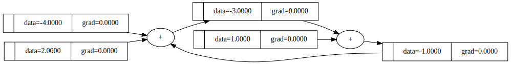
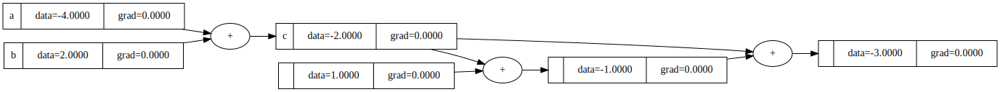
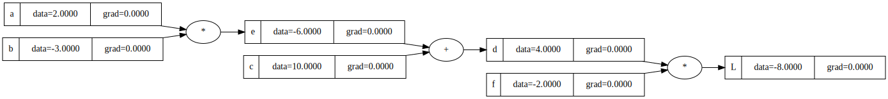
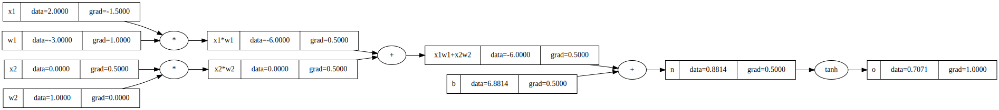

# micrograd-cpp-2023

A C++ implementation of
[karpathy/micrograd](https://github.com/karpathy/micrograd).
Each step of the first episode of *Neural Nets: Zero to Hero*:
[The spelled-out intro to neural networks and backpropagation: building micrograd](https://youtu.be/VMj-3S1tku0)
is included.

This roughly follows the flow of Karpathy's YouTube tutorial, with details specific to this C++ implementation:

 * [What is micrograd-cpp and why is it interesting?](#what-is-micrograd-cpp-and-why-is-it-interesting)
   - [Example usage](#example-usage)
   - [C++ implementation notes](#c-implementation-notes)
 * [Building out the Value object](#building-out-the-value-object)
 * [Visualizing the expression graph](#visualizing-the-expression-graph)
 * [Backpropagation](#backpropagation)
 * [Backpropagation through a neuron](#backpropagation-through-a-neuron)
   - [Activation function](#activation-function)
   - [Math operations](#math-operations)
   - [Multiply-Accumulate](#multiply-accumulate)
   - [randomValue, randomArray](#randomvalue-randomarray)

with [References](#references) at the end for further reading about automatic differentiation and C++ implementations.

## What is micrograd-cpp and why is it interesting?

micrograd-cpp introduces some nuances of backpropagation (reverse-mode autodiff) and its
implementation. At its core is an expression graph which can be evaluated forwards, where
an expression like `a+b` is implemented using `operator+`, and differentiated in reverse
using a `std::function` attached to each graph node to calculate its gradient.

This implementation allows computations using `Value` objects to be written as
normal-looking C++ code.

### Example usage

```c++
#include <iostream>

#include "value.h"

using namespace ai;

int main(int argc, char *argv[])
{
    auto a = make_value(-4.0);
    auto b = make_value(2.0);

    auto c = a + b;
    auto d = a * b + pow(b, 3);

    c += c + 1;
    c += 1 + c + (-a);
    d += d * 2 + relu(b + a);
    d += 3 * d + relu(b - a);
    auto e = c - d;
    auto f = pow(e, 2);
    auto g = f / 2.0;
    g += 10.0 / f;
    printf("%.4f\n", g->data()); // prints 24.7041, the outcome of this forward pass
    backward(g);
    printf("%.4f\n", a->grad()); // prints 138.8338, i.e. the numerical value of dg/da
    printf("%.4f\n", b->grad()); // prints 645.5773, i.e. the numerical value of dg/db
}
```

### C++ implementation notes

1. Data type

Neural nets generally don't require many bits of precision on individual node values,
so let's not limit ourselves to `float` or `double`. We template using `Value<T>`.

2. Sharing

Nodes may appear as inputs to multiple other nodes in the expression graph,
especially for neural networks, so we use a `shared_ptr`:

```c++
using Value<T> = std::shared_ptr<RawValue<T>>;
```

3. Removal of cycles

The expression `c += c + 1` refers to itself, so it contains a cycle. This cycle needs to be
removed in order to implement backpropagation.



In Python, `x += y` usually translates to `x.__iadd__(y)` which modifies `x` in-place.
However, the `Value` objects in `micrograd` don't implement `__iadd__`, so Python falls back to using `__add__` followed by assignment. That means `a += b` is roughly equivalent to `a = a + b`. Each time the + operator is invoked, a new Value object is created and the computational graph gets extended, so it is not modifying the existing objects in-place from a computational graph perspective. Rather, it's creating new nodes in the graph, extending it with more operations to backtrack during the backward() pass.

In C++, `operator+=` requires an explicit implementation which modifies its value in-place.
We create a copy of the old value and re-write all earlier references in the expression graph
to point to the copy.



Note that this aspect of the implementation is peculiar to the operational semantics of C++
and in-place assignment operators. It is straightforward to implement a neural network
without calling these operators, so the overhead of node copying and graph rewriting could
easily be removed. We include it here only for the translation of micrograd to C++.

## Building out the Value object

> Neural nets are some pretty scary expressions. We need some data structures to maintain 
> these expressions.

In order to handle basic expressions like:

```c++
    auto a = make_value(2.0, "a");
    auto b = make_value(-3.0, "b");
    auto c = make_value(10.0, "c");

    auto d = (a*b) + c;
    std::cout << d << std::endl;
```

we start sketching out the underlying `RawValue` class, implementing operators for `+`
and `*`, and storing the inputs (children) of each for the evaluation graph.

```c++
template <typename T>
class RawValue {
    public:
        using ptr = std::shared_ptr<RawValue<T>>;

    private:
        RawValue(const T& data, const std::string& label="")
            : data_(data), label_(label)
        {}

        RawValue(const T& data, std::set<ptr>& children, const std::string& op="")
            : data_(data), prev_(children), op_(op)
        {}

    public:
        template <typename... Args>
        static ptr make(Args&&... args) {
            return ptr(new RawValue<T>(std::forward<Args>(args)...));
        }

        friend ptr operator+(const ptr& a, const ptr& b) {
            std::set<ptr> children = {a, b};
            return make(a->data() + b->data(), children, "+");
        }

        friend ptr operator*(const ptr& a, const ptr& b) {
            std::set<ptr> children = {a, b};
            return make(a->data() * b->data(), children, "*");
        }

    private:
        T data_;
        std::set<ptr> prev_{};
        std::string op_{""};
};

template <typename T>
static inline std::ostream& operator<<(std::ostream& os, const RawValue<T>& value) {
    return os << "Value("
        << "data=" << value.data() << ", "
        << "op=" << value.op()
        << ")";
}
```

In code we use `Value<T>`, which is an alias for `shared_ptr<RawValue<T>>`:

```c++
template <typename T>
using Value = typename RawValue<T>::ptr;

template <typename T, typename... Args>
static Value<T> make_value(const T& data, Args&&... args) {
    return RawValue<T>::make(data, std::forward<Args>(args)...);
}

template <typename T>
static inline std::ostream& operator<<(std::ostream& os, const std::shared_ptr<RawValue<T>>& value) {
    return os << value.get() << "=&" << *value;
}
```

## Visualizing the expression graph

We provide a `Graph` class that can wrap any `Value<T>`. It has a custom `operator<<` that writes in `dot`
language. The implementation is in [include/graph.h](include/graph.h). We also introduce a `label` to the `Value<T>`
object for labelling graph nodes, and an `expr` factory function for creating labelled expressions.

We can pipe the output of a program to `dot -Tsvg` to produce an svg image, or to `xdot` to view it interactively:

```bash
$ build/examples/graph | dot -Tsvg -o graph.svg
$ build/examples/graph | xdot -
```



## Backpropagation

We add a member variable `grad_` that maintains the gradient with respect to the final output.

How each operation affects the output is written as a lambda function, `backward_`.
It copies the `Value` `shared_ptr`s of each node's children in order to increment their reference counts.

```c++
        friend ptr operator+(const ptr& a, const ptr& b) {
            auto out = make(a->data() + b->data(), children, "+");

            out->backward_ = [=]() {
                a->grad_ += out->grad_;
                b->grad_ += out->grad_;
            };

            return out;
        }

        friend ptr operator*(const ptr& a, const ptr& b) {
            std::set<ptr> children = {a, b};
            auto out = make(a->data() * b->data(), children, "*");

            out->backward_ = [=]() {
                a->grad_ += b->data() * out->grad();
                b->grad_ += a->data() * out->grad();
            };

            return out;
        }
```

We recursively apply the local derivatives using the chain rule backwards through the expression graph:

```c++
        friend void backward(const ptr& node) {
            std::vector<RawValue<T>*> topo;
            std::set<RawValue<T>*> visited;

            std::function<void(const ptr&)> build_topo = [&](const ptr& v) {
                if (!visited.contains(v.get())) {
                    visited.insert(v.get());
                    for (auto && c : v->children()) {
                        build_topo(c);
                    }
                    topo.push_back(v.get());
                }
            };

            build_topo(node);

            for (auto & v : topo) {
                v->grad_ = 0.0;
            }

            node->grad_ = 1.0;

            for (auto it = topo.rbegin(); it != topo.rend(); ++it) {
                const RawValue<T>* v = *it;
                auto f = v->backward_;
                if (f) f();
            }
        }
```

## Backpropagation through a neuron

We begin the implementation of a neuron, in [include/nn.h](include/nn.h):

```c++
template <typename T, size_t Nin>
class Neuron {
    public:
        Neuron()
            : weights_(randomArray<T, Nin>()), bias_(randomValue<T>())
        {
        }

        Value<T> operator()(const std::array<Value<T>, Nin>& x) const {
            Value<T> y = mac(weights_, x, bias_);
            return expr(tanh(y), "n");
        }

        ...
};
```

The resulting expression graph for a neuron with four inputs:



### Activation function

In general an activation function modifies the output of a neuron, perhaps so that all neurons have similar ranges of output value or to smooth or filter large and negative values.
Whichever activation function we use, we need to implement a `backward_` function.
This implementation includes `relu` (which just replaces any negative values with zero) and `tanh`, which squashes the output into the range ±1.0. `tanh` is used in the video and has an obvious and continuous effect on the gradient:

```c++
        friend ptr tanh(const ptr& a) {
            std::set<ptr> children = {a};
            double x = a->data();
            double e2x = exp(2.0*x);
            double t = (e2x-1)/(e2x+1);
            auto out = make(t, children, "tanh");

            out->backward_ = [=]() {
                a->grad_ += (1.0 - t*t) * out->grad_;
            };

            return out;
        }
```

### Math operations

We must implement all required math operations on `Value<T>`, including pow, exp, and division,
so that we can accumulate gradients and run backpropagation.

For convenience we also provide operator specializations where one operand is an arithmetic value, so that instead of
writing `a * make_value(7.0)` you can write `a * 7.0` or `7.0 * a`:

```c++
        template<typename N, std::enable_if_t<std::is_arithmetic<N>::value, int> = 0>
        friend ptr operator*(const ptr& a, N n) { return a * make(n); }

        template<typename N, std::enable_if_t<std::is_arithmetic<N>::value, int> = 0>
        friend ptr operator*(N n, const ptr& a) { return make(n) * a; }
```

### Multiply-Accumulate

A neuron takes a number of input values, applies a weight to each, and sums the result. We can abstract this out as a common multiply-accumulate function.
It is usual to use a hardware-optimized, eg. GPU, implementation.
In order to use our explicit `Value` object, we provide a generic implementation is in [include/mac.h](include/mac.h).
This uses `std::execution` to allow the compiler to choose an optimized execution method, allowing parallel and vectorized execution:

```c++
template <typename T, std::size_t N>
T mac(const std::array<T, N>& a, const std::array<T, N>& b, T init = T{}) {
    return std::transform_reduce(
        std::execution::par_unseq, // Use parallel and vectorized execution
        a.begin(), a.end(), // Range of first vector
        b.begin(), // Range of second vector
        init, //static_cast<T>(0), // Initial value
        std::plus<>(), // Accumulate
        std::multiplies<>() // Multiply
    );
}
```

### randomValue, randomArray

We provide helper functions to create random values statically, in deterministic order. This helps with reproducibility for debugging.

The implementation is in [include/random.h](include/random.h).

```c++
// Static inline function to generate a random T
template <typename T>
static inline Value<T> randomValue() {
    static unsigned int seed = 42;
    static thread_local std::mt19937 gen(seed++);
    std::uniform_real_distribution<T> dist(-1.0, 1.0);
    seed = gen(); // update seed for next time
    return make_value(dist(gen));
}

// Static inline function to generate a random std::array<T, N>
template <typename T, size_t N>
static inline std::array<Value<T>, N> randomArray() {
    std::array<Value<T>, N> arr;
    for (auto& element : arr) {
        element = randomValue<T>();
    }
    return arr;
}
```

## References

### Automatic differentiation in C++
* https://www.youtube.com/watch?v=1QQj1mAV-eY
* https://compiler-research.org/assets/presentations/CladInROOT_15_02_2020.pdf
* https://arxiv.org/abs/2102.03681

### Automatic differentiation
* https://hackage.haskell.org/package/ad


